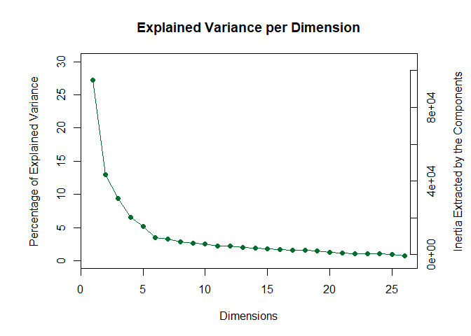
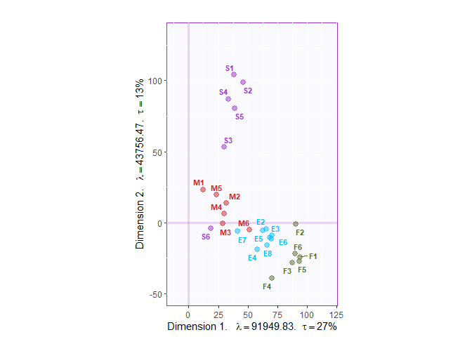
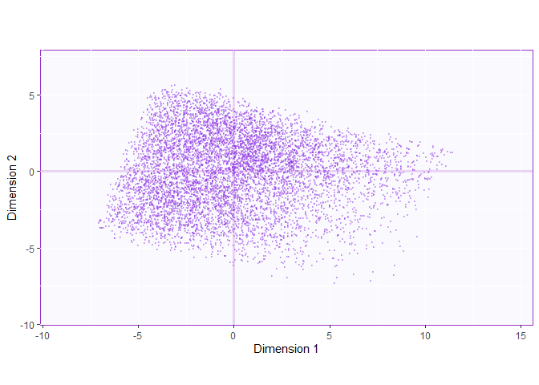
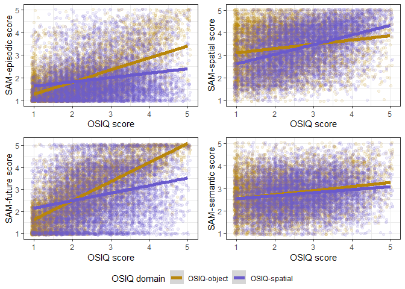
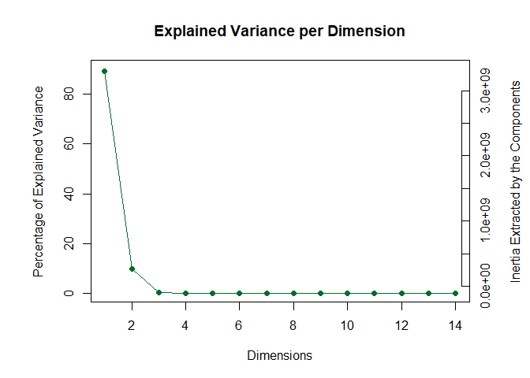
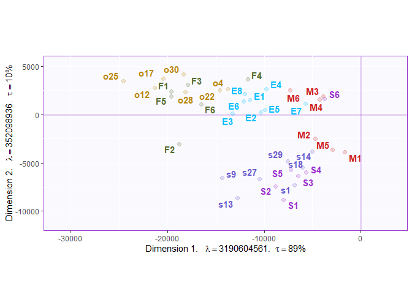
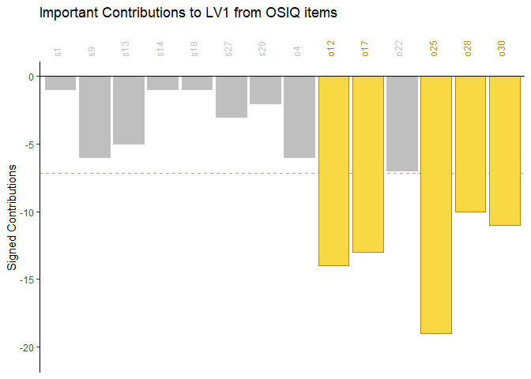
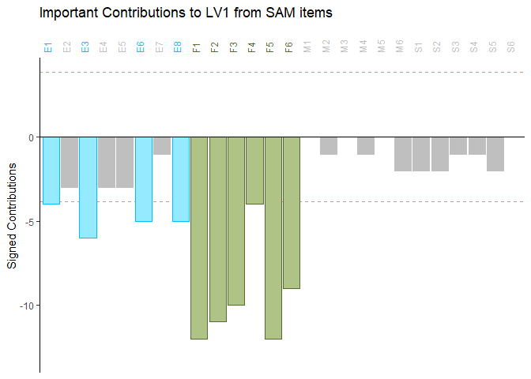
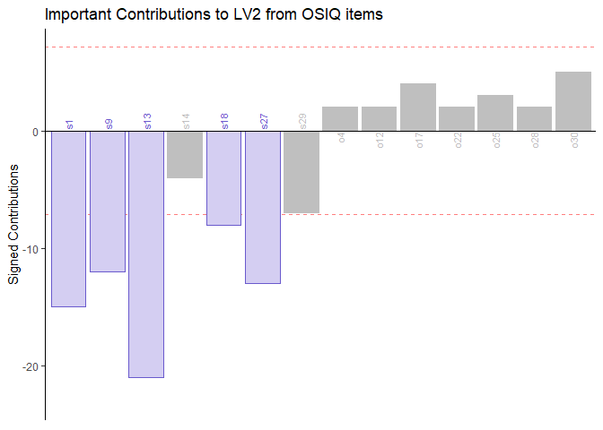
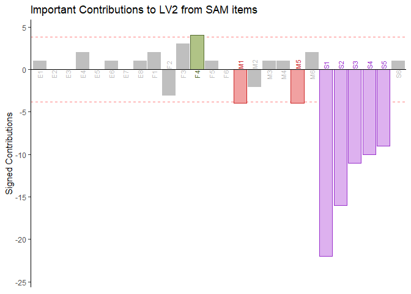

Figures
================
Carina Fan
\| Last updated: March 25, 2024

- [Set up](#set-up)
- [figure 1: scree plot and dim 1 vs 2 for PCA on
  SAM](#figure-1-scree-plot-and-dim-1-vs-2-for-pca-on-sam)
- [figure 2: univariate relationships between SAM and
  OSIQ](#figure-2-univariate-relationships-between-sam-and-osiq)
- [figure 3: PLSC on SAM and OSIQ](#figure-3-plsc-on-sam-and-osiq)
- [figure 4: contributions to PLSC
  LVs](#figure-4-contributions-to-plsc-lvs)
- [Session info](#session-info)

# Set up

This script uses the same workspace that is created by the main analysis
script.

``` r
load("analysis_workspace.RData")
```

``` r
suppressPackageStartupMessages({
  library(corrplot)
  library(ExPosition)
  library(gplots)
  library(gridExtra)
  library(lmSupport)
  library(psych)
  library(PTCA4CATA)
  library(readxl)
  library(reshape)
  library(TInPosition)
  library(wrapr)
  library(magrittr)
  library(tidyverse)})
```

``` r
# function to create shared legend across multiple ggplots
# from http://rpubs.com/sjackman/grid_arrange_shared_legend

grid_arrange_shared_legend <- function(...) {
  plots <- list(...)
  g <- ggplotGrob(plots[[1]] + theme(legend.position="bottom"))$grobs
  legend <- g[[which(sapply(g, function(x) x$name) == "guide-box")]]
  lheight <- sum(legend$height)
  grid.arrange(
    do.call(arrangeGrob, lapply(plots, function(x)
      x + theme(legend.position="none"))),
    legend,
    ncol = 1,
    heights = grid::unit.c(unit(1, "npc") - lheight, lheight))
}
```

<!-- ======================================================================= -->

# figure 1: scree plot and dim 1 vs 2 for PCA on SAM

``` r
# scree plot

# tiff("figures/sam_scree.tiff", width = 6, height = 4, units = "in", res = 600)

PTCA4CATA::PlotScree(
  ev = pca.sam$ExPosition.Data$pdq$tau,
  max.ev = max(pca.sam$ExPosition.Data$eig)
) +
  coord_fixed(ratio = .5)
```

<!-- -->

    ## NULL

``` r
# dev.off()

# set up for PCA plots

Fj.sam = pca.sam$ExPosition.Data$fj

map_labels = createxyLabels.gen(
  x_axis = 1, y_axis = 2,
  lambda = pca.sam$ExPosition.Data$eigs,
  tau = pca.sam$ExPosition.Data$t)

jmap.sam = PTCA4CATA::createFactorMap(
  Fj.sam,
  col.points = colour.sam,
  col.labels = colour.sam,
  alpha.points. = .3,
  text.cex = 3)

jaggmap.sam =
  jmap.sam$zeMap_background +
  jmap.sam$zeMap_dots +
  jmap.sam$zeMap_text +
  coord_fixed(ratio = 1.2) +
  map_labels
```

    ## Coordinate system already present. Adding new coordinate system, which will
    ## replace the existing one.

``` r
Fi.sam = pca.sam$ExPosition.Data$fi

imap.sam = PTCA4CATA::createFactorMap(
  Fi.sam,
  display.labels = FALSE,
  alpha.points = .3,
  cex = .3,
  text.cex = 3)

iaggmap.sam =
  imap.sam$zeMap_background +
  imap.sam$zeMap_dots +
  coord_equal(ratio = .8)
```

    ## Coordinate system already present. Adding new coordinate system, which will
    ## replace the existing one.

``` r
# PCA plot of variables

# tiff("figures/sam_pca_dim1v2.tiff", width = 3, height = 4, units = "in", res = 600)

print(jaggmap.sam)
```

    ## Warning: ggrepel: 1 unlabeled data points (too many overlaps). Consider
    ## increasing max.overlaps

<!-- -->

``` r
# dev.off()

# PCA plot of subjects 

# tiff("figures/sam_pca_dim1v2_subjects.tiff", width = 3, height = 2, units = "in", res = 600)

print(iaggmap.sam)
```

<!-- -->

``` r
# dev.off()
```

<!-- ======================================================================= -->

# figure 2: univariate relationships between SAM and OSIQ

``` r
scatter_samE_osiq =   
  df.sam.osiq %>%
  select(sam_epi_raw, osiq_mini_o, osiq_mini_s) %>%
  melt(id = "sam_epi_raw", measured = c("osiq_mini_o", "osiq_mini_s")) %>% 
  ggplot(aes(x = value, y = sam_epi_raw, colour = variable)) +
  geom_point(alpha = .1, position = "jitter") +
  geom_smooth(method = "lm", size = 2) +
  theme_bw() +
  labs(x = "OSIQ score", y = "SAM-episodic score") +
  scale_colour_manual(name = "OSIQ domain", 
                      values = colourCode.osiq,
                      labels = c("OSIQ-object", "OSIQ-spatial"))
```

    ## Warning: Using `size` aesthetic for lines was deprecated in ggplot2 3.4.0.
    ## ℹ Please use `linewidth` instead.
    ## This warning is displayed once every 8 hours.
    ## Call `lifecycle::last_lifecycle_warnings()` to see where this warning was
    ## generated.

``` r
scatter_samS_osiq =   
  df.sam.osiq %>%
  select(sam_spa_raw, osiq_mini_o, osiq_mini_s) %>%
  melt(id = "sam_spa_raw", measured = c("osiq_mini_o", "osiq_mini_s")) %>% 
  ggplot(aes(x = value, y = sam_spa_raw, colour = variable)) +
  geom_point(alpha = .1, position = "jitter") +
  geom_smooth(method = "lm", size = 2) +
  theme_bw() +
  labs(x = "OSIQ score", y = "SAM-spatial score") +
  scale_colour_manual(name = "OSIQ domain", 
                      values = colourCode.osiq,
                      labels = c("OSIQ-object", "OSIQ-spatial"))

scatter_samF_osiq =   
  df.sam.osiq %>%
  select(sam_fut_raw, osiq_mini_o, osiq_mini_s) %>%
  melt(id = "sam_fut_raw", measured = c("osiq_mini_o", "osiq_mini_s")) %>% 
  ggplot(aes(x = value, y = sam_fut_raw, colour = variable)) +
  geom_point(alpha = .1, position = "jitter") +
  geom_smooth(method = "lm", size = 2) +
  theme_bw() +
  labs(x = "OSIQ score", y = "SAM-future score") +
  scale_colour_manual(name = "OSIQ domain",
                      values = colourCode.osiq,
                      labels = c("OSIQ-object", "OSIQ-spatial"))

scatter_samM_osiq =
  df.sam.osiq %>%
  select(sam_sem_raw, osiq_mini_o, osiq_mini_s) %>%
  melt(id = "sam_sem_raw", measured = c("osiq_mini_o", "osiq_mini_s")) %>% 
  ggplot(aes(x = value, y = sam_sem_raw, colour = variable)) +
  geom_point(alpha = .1, position = "jitter") +
  geom_smooth(method = "lm", size = 2) +
  theme_bw() +
  labs(x = "OSIQ score", y = "SAM-semantic score") +
  scale_colour_manual(name = "OSIQ domain",
                      values = colourCode.osiq,
                      labels = c("OSIQ-object", "OSIQ-spatial"))

# png("figures/sam_osiq_scatter.png", width = 10, height = 10, units = "in", res = 300)

grid_arrange_shared_legend(scatter_samE_osiq, scatter_samS_osiq, 
                           scatter_samF_osiq, scatter_samM_osiq)
```

    ## `geom_smooth()` using formula = 'y ~ x'
    ## `geom_smooth()` using formula = 'y ~ x'
    ## `geom_smooth()` using formula = 'y ~ x'
    ## `geom_smooth()` using formula = 'y ~ x'
    ## `geom_smooth()` using formula = 'y ~ x'

<!-- -->

``` r
# dev.off()
```

<!-- ======================================================================= -->

# figure 3: PLSC on SAM and OSIQ

``` r
# scree plot

# png("figures/sam_osiq_scree.png", width = 5, height = 5, units = "in", res = 600)

PTCA4CATA::PlotScree(
  ev = plsc.sam.osiq$TExPosition.Data$eigs,
  max.ev = max(plsc.sam.osiq$TExPosition.Data$eigs)
)
```

<!-- -->

``` r
# dev.off()

# variable plot

loadings = rbind(plsc.sam.osiq$TExPosition.Data$fi,
                 plsc.sam.osiq$TExPosition.Data$fj)

colnames(loadings) = paste0("Dimension ", 1:ncol(loadings))

colour.plsc = c(colour.osiq, colour.sam)

map.loadings = PTCA4CATA::createFactorMap(
  loadings,
  col.points = colour.plsc,
  alpha.points = .2,
  cex = 2,
  col.labels = colour.plsc)

map_labels = createxyLabels.gen(
  x_axis = 1, y_axis = 2,
  lambda = plsc.sam.osiq$TExPosition.Data$eigs,
  tau = plsc.sam.osiq$TExPosition.Data$t)

aggmap.loadings =
  map.loadings$zeMap_background +
  map.loadings$zeMap_text +
  map.loadings$zeMap_dots +
  map_labels

# png("figures/sam_osiq_plsc.png", width = 6, height = 4, units = "in", res = 300)

print(aggmap.loadings)
```

<!-- -->

``` r
# dev.off()
```

<!-- ======================================================================= -->

# figure 4: contributions to PLSC LVs

``` r
# LV1 OSIQ

Fi = plsc.sam.osiq$TExPosition.Data$fi

contrib.i = plsc.sam.osiq$TExPosition.Data$ci

contrib.i.signed = contrib.i* sign(Fi)

# png("figures/plsc_osiq_lv1.png", width = 5, height = 3, units = "in", res = 600)

PrettyBarPlot2(
  bootratio = round(100 * contrib.i.signed[,1]),
  threshold = 100/ nrow(contrib.i.signed),
  ylim = NULL,
  color4bar = gplots::col2hex(colour.osiq),
  color4ns = "gray75",
  plotnames = TRUE,
  main = "Important Contributions to LV1 from OSIQ items",
  ylab = "Signed Contributions")
```

    ## Warning: Vectorized input to `element_text()` is not officially supported.
    ## ℹ Results may be unexpected or may change in future versions of ggplot2.

<!-- -->

``` r
# dev.off()

# LV1 SAM

Fj = plsc.sam.osiq$TExPosition.Data$fj

contrib.j = plsc.sam.osiq$TExPosition.Data$cj

contrib.j.signed = contrib.j * sign(Fj)

# png("figures/plsc_sam_lv1.png", width = 5, height = 3, units = "in", res = 600)

PrettyBarPlot2(
  bootratio = round(100 * contrib.j.signed[,1]),
  threshold = 100/ nrow(contrib.j.signed),
  ylim = NULL,
  color4bar = gplots::col2hex(colour.sam),
  color4ns = "gray75",
  plotnames = TRUE,
  main = "Important Contributions to LV1 from SAM items",
  ylab = "Signed Contributions")
```

    ## Warning: Vectorized input to `element_text()` is not officially supported.
    ## ℹ Results may be unexpected or may change in future versions of ggplot2.

<!-- -->

``` r
# dev.off()

# LV2 OSIQ

# png("figures/plsc_osiq_lv2.png", width = 5, height = 3, units = "in", res = 600)

PrettyBarPlot2(
  bootratio = round(100 * contrib.i.signed[,2]),
  threshold = 100/ nrow(contrib.i.signed),
  ylim = NULL,
  color4bar = gplots::col2hex(colour.osiq),
  color4ns = "gray75",
  plotnames = TRUE,
  main = "Important Contributions to LV2 from OSIQ items",
  ylab = "Signed Contributions")
```

<!-- -->

``` r
# dev.off()

# LV2 SAM

# png("figures/plsc_sam_lv2.png", width = 5, height = 3, units = "in", res = 600)

PrettyBarPlot2(
  bootratio = round(100 * contrib.j.signed[,2]),
  threshold = 100/ nrow(contrib.j.signed),
  ylim = NULL,
  color4bar = gplots::col2hex(colour.sam),
  color4ns = "gray75",
  plotnames = TRUE,
  main = "Important Contributions to LV2 from SAM items",
  ylab = "Signed Contributions")
```

<!-- -->

``` r
# dev.off()
```

<!-- ======================================================================= -->

# Session info

``` r
sessionInfo()
```

    ## R version 4.3.3 (2024-02-29 ucrt)
    ## Platform: x86_64-w64-mingw32/x64 (64-bit)
    ## Running under: Windows 10 x64 (build 19045)
    ## 
    ## Matrix products: default
    ## 
    ## 
    ## locale:
    ## [1] LC_COLLATE=English_Canada.utf8  LC_CTYPE=English_Canada.utf8   
    ## [3] LC_MONETARY=English_Canada.utf8 LC_NUMERIC=C                   
    ## [5] LC_TIME=English_Canada.utf8    
    ## 
    ## time zone: America/Toronto
    ## tzcode source: internal
    ## 
    ## attached base packages:
    ## [1] stats     graphics  grDevices utils     datasets  methods   base     
    ## 
    ## other attached packages:
    ##  [1] lubridate_1.9.3      forcats_1.0.0        stringr_1.5.1       
    ##  [4] dplyr_1.1.4          purrr_1.0.2          readr_2.1.4         
    ##  [7] tidyr_1.3.1          tibble_3.2.1         ggplot2_3.5.0       
    ## [10] tidyverse_2.0.0      magrittr_2.0.3       wrapr_2.1.0         
    ## [13] TInPosition_0.10.4   InPosition_0.12.7.1  TExPosition_2.6.10.1
    ## [16] reshape_0.8.9        readxl_1.4.3         PTCA4CATA_0.1.0     
    ## [19] psych_2.4.3          lmSupport_2.9.13     gridExtra_2.3       
    ## [22] gplots_3.1.3.1       ExPosition_2.8.23    prettyGraphs_2.1.6  
    ## [25] corrplot_0.92       
    ## 
    ## loaded via a namespace (and not attached):
    ##   [1] libcoin_1.0-10          rstudioapi_0.15.0       jsonlite_1.8.8         
    ##   [4] TH.data_1.1-2           modeltools_0.2-23       farver_2.1.1           
    ##   [7] pwr_1.3-0               nloptr_2.0.3            rmarkdown_2.25         
    ##  [10] ragg_1.3.0              vctrs_0.6.5             minqa_1.2.6            
    ##  [13] askpass_1.2.0           htmltools_0.5.7         curl_5.2.0             
    ##  [16] broom_1.0.5             cellranger_1.1.0        unmarked_1.4.1         
    ##  [19] KernSmooth_2.23-22      pbkrtest_0.5.2          plyr_1.8.9             
    ##  [22] sandwich_3.1-0          zoo_1.8-12              uuid_1.2-0             
    ##  [25] mime_0.12               lifecycle_1.0.4         pkgconfig_2.0.3        
    ##  [28] Matrix_1.6-5            R6_2.5.1                fastmap_1.1.1          
    ##  [31] shiny_1.8.0             digest_0.6.33           colorspace_2.1-0       
    ##  [34] textshaping_0.3.7       labeling_0.4.3          fansi_1.0.6            
    ##  [37] timechange_0.2.0        mgcv_1.9-1              abind_1.4-5            
    ##  [40] compiler_4.3.3          fontquiver_0.2.1        withr_3.0.0            
    ##  [43] backports_1.4.1         carData_3.0-5           highr_0.10             
    ##  [46] MASS_7.3-60.0.1         openssl_2.1.1           gfonts_0.2.0           
    ##  [49] gtools_3.9.5            caTools_1.18.2          tools_4.3.3            
    ##  [52] zip_2.3.1               httpuv_1.6.13           glue_1.6.2             
    ##  [55] nlme_3.1-164            promises_1.2.1          grid_4.3.3             
    ##  [58] generics_0.1.3          gtable_0.3.4            tzdb_0.4.0             
    ##  [61] hms_1.1.3               xml2_1.3.6              car_3.1-2              
    ##  [64] coin_1.4-3              utf8_1.2.4              ggrepel_0.9.5          
    ##  [67] pillar_1.9.0            later_1.3.2             AICcmodavg_2.3-3       
    ##  [70] splines_4.3.3           lattice_0.22-5          survival_3.5-8         
    ##  [73] tidyselect_1.2.1        rvg_0.3.3               fontLiberation_0.1.0   
    ##  [76] knitr_1.45              fontBitstreamVera_0.1.1 gvlma_1.0.0.3          
    ##  [79] crul_1.4.0              stats4_4.3.3            xfun_0.41              
    ##  [82] matrixStats_1.2.0       stringi_1.8.3           VGAM_1.1-10            
    ##  [85] yaml_2.3.8              boot_1.3-29             evaluate_0.23          
    ##  [88] codetools_0.2-19        httpcode_0.3.0          officer_0.6.5          
    ##  [91] gdtools_0.3.7           cli_3.6.2               xtable_1.8-4           
    ##  [94] systemfonts_1.0.6       munsell_0.5.0           Rcpp_1.0.11            
    ##  [97] parallel_4.3.3          ellipsis_0.3.2          bitops_1.0-7           
    ## [100] lme4_1.1-35.1           mvtnorm_1.2-4           scales_1.3.0           
    ## [103] crayon_1.5.2            rlang_1.1.2             multcomp_1.4-25        
    ## [106] mnormt_2.1.1
